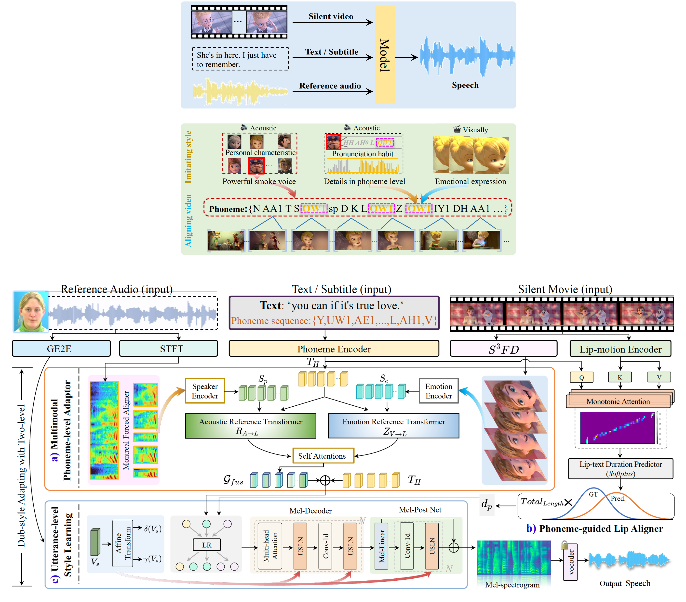
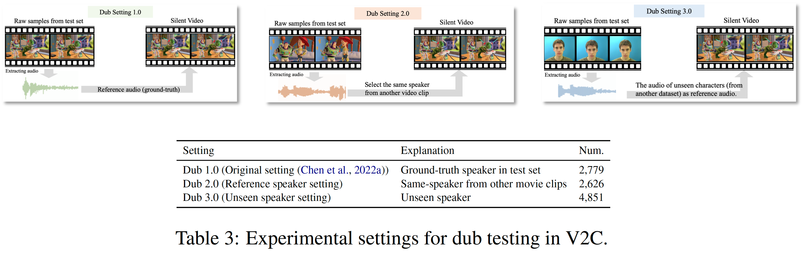

# StyleDubber
This package contains the accompanying code for the following paper:

"StyleDubber: Towards Multi-Scale Style Learning for Movie Dubbing", which has appeared as long paper in the Findings of the ACL, 2024.



## 📣 News


## 🗒 TODOs
- [x] Release StyleDubber's training and inference code.
- [x] Release pretrained weights.
- [x] Release the raw data and preprocessed data features of the GRID dataset.
- [x] Metrics Testing Scripts (SECS, WER_Whisper).
- [x] Release [Demo Pages](https://acl2024x.github.io/StyleDubber/).
- [x] Release the preprocessed data features of the V2C-Animation dataset.
- [ ] Update README.md (How to use). 


## 📊 Dataset

- GRID ([BaiduDrive](https://pan.baidu.com/s/1E4cPbDvw_Zfk3_F8qoM7JA) (code: GRID) / GoogleDrive)

```
├── Lip_Grid_Gray
                          
    │       └── [GRID's Lip Region Images in Gray-scale] 

├── Lip_Grid_Color
                          
    │       └── [GRID's Lip Region Images in RGB] 

├── Grid_resample_ABS
                          
    │       └── [22050 Hz Ground Truth Audio Files in .wav] (The original data of GRID is 25K Hz)
    
├── Grid_lip_Feature
                          
    │       └── [Lip Feature extracted from ```Lip_Grid_Gray``` via Lipreading_using_Temporal_Convolutional_Networks] 

├── Grid_Face_Image
                          
    │       └── [GRID's Face Region Images] 

├── Grid_dataset_Raw
                          
    │       └── [GRID's raw data from Website] 

├── Grad_eachframe
                          
    │       └── [Each frame files of Grid dataset] 

├── Gird_FaceVAFeature
                          
    │       └── [Face Feature extracted from ```Grid_Face_Image``` via EmoFAN] 

├── 0_Grid_Wav_22050_Abs_Feature
                          
            └── [Contains all the data features for train and inference in the GRID dataset]  
```

**Note**: If you just want to train ```StyleDubber```, you only need to download the files in ```0_Grid_Wav_22050_Abs_Feature``` (Preprocessed data features) and ```Grid_resample_ABS``` (Waveform used for testing). If you're going to plot and display, use it for other tasks (lip reading, ASV, etc.), or re-preprocess features on your way, you can download other files you need 😊. 


- V2C-Animation dataset (chenqi-Denoise2) ([BaiduDrive]( https://pan.baidu.com/s/12hEFbXwpv4JscG3tUffjbA) (code: k9mb) / GoogleDrive)


```
├── Phoneme_level_Feature
                  
    │       └── [Contains all the data features for train and inference in the V2C-Animation dataset] 

├── GT_Wav
                  
            └── [22050 Hz ground truth Audio Files in .wav] 
```


**Note**: For training on V2C-Animation, you need to download the files in ```Phoneme_level_Feature``` and ```GT_Wav```. 
Other visual images (e.g., face and lip regions) in intermediate processes can be accessed at HPMDubbing. 

Quick Q&A: HPMDubbing also has pre-processed features. Are they the same？ Can I download it to train StyleDubber?

No, you need to re-download.  HPMDubbing needs frame frame-level feature with 220 hop length and 880 window length for the desired upsampling manner. 
```StyleDubber``` currently only supports phoneme-level features and we adjust the hop length (256) and window length (1024) during pre-processing. 


## 💡 Checkpoints

We provide the pre-trained checkpoints on GRID and V2C-Animation datasets as follows, respectively:


- GRID: https://pan.baidu.com/s/1Mj3MN4TuAEc7baHYNqwbYQ (y8kb), [Google Drive](https://drive.google.com/file/d/1ehSKyKw_UkKiNJCcupujcLAmyTtvxaEY/view?usp=drive_link)

- V2C-Animation dataset (chenqi-Denoise2): https://pan.baidu.com/s/1hZBUszTaxCTNuHM82ljYWg (n8p5), [Google Drive](https://drive.google.com/file/d/1B3SIhActrdOEtVxktgW8K06_wf0GOeqN/view?usp=drive_link)

## ⚒️ Environment

Our python version is ```3.8.18``` and cuda version ```11.5```. It's possible to have other compatible version. 
Both training and inference are implemented with PyTorch on a
GeForce RTX 4090 GPU. 

```bash
conda create -n style_dubber python=3.8.18
conda activate style_dubber
pip install -r requirements.txt
```

## 🔥 Train Your Own Model 

You need repalce tha path in ```preprocess_config``` (see "./ModelConfig_V2C/model_config/MovieAnimation/config_all.txt") to you own path. 
Training V2C-Animation dataset (153 cartoon speakers), please run: 
```bash
python train_StyleDubber_V2C.py
```


You need repalce tha path in ```preprocess_config``` (see "./ModelConfig_GRID/model_config/GRID/config_all.txt") to you own path. 
Training GRID dataset (33 real-world speakers), please run:  
```bash
python train_StyleDubber_GRID.py
```

## ⭕ Inference 




```bash
python 0_evaluate_V2C_Setting1.py --restore_step 47000
```

```bash
python 0_evaluate_V2C_Setting2.py --restore_step 47000
```

```bash
python 0_evaluate_V2C_Setting3.py --restore_step 47000
```

## ✏️ Citing

If you find our work useful, please consider citing:
```BibTeX
@article{cong2024styledubber,
  title={StyleDubber: Towards Multi-Scale Style Learning for Movie Dubbing},
  author={Cong, Gaoxiang and Qi, Yuankai and Li, Liang and Beheshti, Amin and Zhang, Zhedong and Hengel, Anton van den and Yang, Ming-Hsuan and Yan, Chenggang and Huang, Qingming},
  journal={arXiv preprint arXiv:2402.12636},
  year={2024}
}
```

## 🙏 Acknowledgments

We would like to thank the authors of previous related projects for generously sharing their code and insights: [CDFSE_FastSpeech2](https://github.com/Labmem-Zhouyx/CDFSE_FastSpeech2), [Multimodal Transformer](https://github.com/yaohungt/Multimodal-Transformer), [SMA](https://github.com/keonlee9420/Stepwise_Monotonic_Multihead_Attention), [Meta-StyleSpeech](https://github.com/KevinMIN95/StyleSpeech), and [FastSpeech2](https://github.com/ming024/FastSpeech2).
